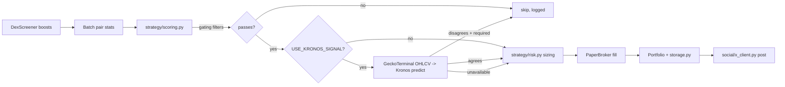

# memecoin_bot

A Solana memecoin FOMO/momentum **paper-trading** bot. It reads public,
unauthenticated market data (DexScreener + GeckoTerminal), scores tokens for
short-term FOMO/momentum, optionally asks the [Kronos](../README.md)
foundation model for a directional confirmation, manages a fully simulated
paper portfolio with real risk controls, and can post transparent, factual
trade logs to X (Twitter) after each trade.

## ⚠️ Safety posture (read this first)

- **Paper trading only.** This bot never holds a real wallet private key and
  never submits a real on-chain transaction. `trading/broker.py` defines a
  `Broker` interface with a fully-working `PaperBroker` (simulated fills,
  slippage, and fees) and an explicit `LiveJupiterBroker` **stub** that
  raises `NotImplementedError` and documents exactly what real
  implementation would require. There is no code path in this repository
  that can move real funds.
- **Not financial advice.** Memecoins are highly volatile, frequently
  manipulated, and often illiquid. Nothing this bot does or posts is
  investment advice, and its scores/signals are not predictive guarantees.
- **X posts are transparent trade logs, not promotion.** Every post is sent
  *after* a (simulated) trade happens, states it is a simulated/paper trade
  (e.g. "📝 Simulated trade — not financial advice"), and reports only
  factual numbers: action, token, entry/exit price, virtual USD size, P&L%,
  and hold time. `social/templates.py` includes an honesty guardrail
  (`contains_hype_language`) that the test suite asserts every template
  passes -- no hype/promotional language, ever.
- **X posting defaults to safe "dry" mode.** Posts are only logged locally
  unless *both* `ENABLE_X_POSTING=true` *and* all four `X_API_KEY` /
  `X_API_SECRET` / `X_ACCESS_TOKEN` / `X_ACCESS_TOKEN_SECRET` credentials are
  present. Posting is also rate-limited and deduped
  (`X_MIN_SECONDS_BETWEEN_POSTS`, `X_MAX_POSTS_PER_HOUR`) to respect X's API
  limits and avoid spam.
- **No private key material, ever.** All secrets are read from environment
  variables / a gitignored `.env` file, never hardcoded. This codebase has
  no concept of a Solana keypair or seed phrase anywhere in it.
- **You are responsible for compliance.** Before ever attempting *live*
  trading (which this repo does not implement) or automated posting at
  scale, you are responsible for complying with X's platform/automation
  policies and the financial regulations that apply to you locally.

## Architecture

```
memecoin_bot/
  config.py          Settings dataclass, loaded from .env (see .env.example)
  storage.py          SQLite (stdlib sqlite3): scans, trades, equity curve
  data/
    dexscreener.py     DexScreener client (discovery, search, batch pair stats)
    geckoterminal.py    GeckoTerminal OHLCV client (candles for Kronos)
    types.py            Shared dataclasses: TokenPair, Candle, ScoredCandidate
  strategy/
    scoring.py           FOMO/momentum composite score + gating filters
    risk.py              Position sizing, stop-loss/take-profit, circuit breaker
    kronos_signal.py     Optional Kronos model confirmation (never crashes)
  trading/
    broker.py            Broker ABC, PaperBroker, LiveJupiterBroker (stub)
    portfolio.py          Cash/positions/P&L/equity-curve accounting
  social/
    templates.py          Factual-only tweet templates + hype-language guardrail
    x_client.py            XPoster: safe dry-run default, rate-limit/dedupe
  bot.py                MemecoinBot orchestrator (one scan/trade/post cycle)
  cli.py                argparse entrypoint: scan / run / stats
```

Data flow for one cycle (see `bot.py:MemecoinBot.run_once`):



## Installation

```bash
# From the repo root:
pip install -r requirements-bot.txt        # core bot deps (no torch/pandas)
pip install -r requirements.txt            # only if you want USE_KRONOS_SIGNAL=true
cp .env.example .env                       # then edit .env as needed
```

## Configuration

All configuration is documented in [`../.env.example`](../.env.example) at
the repo root and loaded by `memecoin_bot/config.py` via `python-dotenv`.
Highlights:

| Variable | Default | Purpose |
|---|---|---|
| `MIN_LIQUIDITY_USD`, `MIN_TOKEN_AGE_MINUTES`, `MAX_TOKEN_AGE_HOURS` | 10000 / 10 / 72 | Hard gating filters before scoring |
| `MIN_SCORE_TO_BUY` | 60 | Minimum composite FOMO score (0-100) to consider a buy |
| `STARTING_BALANCE_USD` | 1000 | Paper portfolio starting cash |
| `POSITION_SIZE_PCT`, `MAX_POSITION_USD` | 0.05 / 100 | Position sizing: % of equity, capped |
| `STOP_LOSS_PCT`, `TAKE_PROFIT_PCT`, `MAX_HOLD_MINUTES` | 0.15 / 0.40 / 180 | Exit rules |
| `MAX_OPEN_POSITIONS` | 5 | Max concurrent paper positions |
| `DAILY_REALIZED_LOSS_LIMIT_USD` | 150 | Circuit breaker: halts new entries for the rest of the UTC day if breached |
| `USE_KRONOS_SIGNAL`, `KRONOS_REQUIRE_AGREEMENT` | false / true | Optional model confirmation and whether disagreement vetoes a buy |
| `ENABLE_X_POSTING` + `X_API_KEY`/`X_API_SECRET`/`X_ACCESS_TOKEN`/`X_ACCESS_TOKEN_SECRET` | false / unset | Real X posting requires **all** of these |

## Usage

```bash
# Read-only: fetch + score candidates, print a ranked table. No trading, no posting.
python -m memecoin_bot.cli scan

# Run a single scan -> score -> manage -> trade -> log cycle and exit.
python -m memecoin_bot.cli run --once --dry-run --no-post

# Run continuously (Ctrl+C to stop), scanning every 60s, posting if configured.
python -m memecoin_bot.cli run --interval 60

# Useful run flags:
#   --once                 run one cycle and exit (vs. an infinite loop)
#   --post / --no-post     force-enable/disable X posting attempts this run
#   --use-kronos/--no-kronos  override USE_KRONOS_SIGNAL for this run
#   --max-positions N      override MAX_OPEN_POSITIONS
#   --starting-balance N   override STARTING_BALANCE_USD (fresh DB only)

# Print portfolio equity/P&L summary from storage.
python -m memecoin_bot.cli stats
```

The bot persists state in a SQLite file (`DB_PATH`, default
`memecoin_bot.db`); restarting `run` picks up existing open positions and
cash correctly instead of resetting to the starting balance.

## Testing

```bash
# From the repo root (so `memecoin_bot` and `model` resolve as packages):
python -m pytest memecoin_bot/tests/
```

Tests cover scoring math, risk/position-sizing/exit logic, portfolio P&L
accounting, tweet-template content (disclaimer + no hype language),
storage persistence, and DexScreener/GeckoTerminal response parsing against
mocked HTTP (via the `responses` library) -- no real network calls are made
in the test suite.

## Extending to live trading (not implemented, by design)

`trading/broker.py`'s `LiveJupiterBroker` is an explicit, documented stub.
Constructing it always raises `NotImplementedError`. To ever implement real
trading you would need, at minimum: secure custody of a funded Solana
keypair (never a plaintext env var), integration with
[Jupiter's Swap API](https://station.jup.ag/docs/apis/swap-api) for
routing/quotes, priority-fee/compute-unit budgeting, slippage-bounded quote
validation before signing, and real transaction signing/submission with
confirmation and retry handling. None of that exists here -- see the class
docstring for the full list. Do not build it without fully understanding
the financial and security risks involved.
