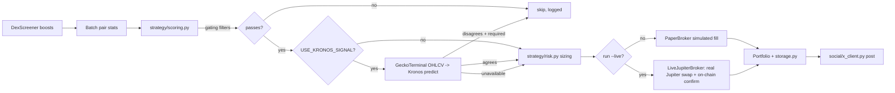

# memecoin_bot

A Solana memecoin FOMO/momentum bot. It reads public, unauthenticated market
data (DexScreener + GeckoTerminal), scores tokens for short-term
FOMO/momentum, optionally asks the [Kronos](../README.md) foundation model
for a directional confirmation, manages a portfolio with real risk
controls, and can post transparent, factual trade logs to X (Twitter) after
each trade.

**Paper trading (fully simulated, no real funds) is the default and always
available.** Real **live trading** on Solana via Jupiter is also supported,
but is entirely opt-in and gated behind multiple explicit, deliberate steps
-- see "Going Live" below. If you only want to experiment safely, you never
need to touch any of the live-trading configuration at all.

## ⚠️ Safety posture (read this first)

- **Paper trading is the default.** Running `python -m memecoin_bot.cli run`
  (without `--live`) never holds a real wallet private key in memory for
  trading purposes and never submits a real on-chain transaction --
  `trading/broker.py`'s `PaperBroker` only simulates fills (slippage + fees)
  against public market data. Nothing about installing this bot or running
  it normally puts real funds at risk.
- **Live trading exists, but is heavily gated.** `trading/live_broker.py`'s
  `LiveJupiterBroker` is a real, network-touching implementation that signs
  and submits real Solana transactions via Jupiter's Swap API. It is only
  ever constructed when `run --live` is invoked, and that itself refuses to
  start unless *all* of: `ENABLE_LIVE_TRADING=true`, a configured
  `SOLANA_PRIVATE_KEY`, a **private** (non-public) `SOLANA_RPC_URL`, and the
  `--i-understand-live-trading-risk` CLI flag (never persisted -- typed
  fresh on every single invocation) are present. See "Going Live" below for
  the full checklist and every additional safety property (real-balance
  checks before every trade, mandatory on-chain confirmation, no blind
  retries, conservative small-budget risk defaults).
- **Not financial advice.** Memecoins are highly volatile, frequently
  manipulated, and often illiquid. Nothing this bot does or posts is
  investment advice, and its scores/signals are not predictive guarantees.
- **X posts are transparent trade logs, not promotion.** Every post is sent
  *after* a trade happens (simulated, or a real confirmed live trade),
  states which kind it was (e.g. "📝 Simulated trade — not financial advice"
  or "⚠️ Live trade — real funds, not financial advice"), and reports only
  factual numbers: action, token, entry/exit price, USD size, P&L%, and hold
  time. `social/templates.py` includes an honesty guardrail
  (`contains_hype_language`) that the test suite asserts every template
  passes in both modes -- no hype/promotional language, ever.
- **X posting defaults to safe "dry" mode.** Posts are only logged locally
  unless *both* `ENABLE_X_POSTING=true` *and* all four `X_API_KEY` /
  `X_API_SECRET` / `X_ACCESS_TOKEN` / `X_ACCESS_TOKEN_SECRET` credentials are
  present. Posting is also rate-limited and deduped
  (`X_MIN_SECONDS_BETWEEN_POSTS`, `X_MAX_POSTS_PER_HOUR`) to respect X's API
  limits and avoid spam.
- **Private key material is handled narrowly and deliberately.** The only
  place a real private key is ever read is `trading/wallet.py`, directly
  from the `SOLANA_PRIVATE_KEY` environment variable, at the moment it's
  needed to sign a transaction. `config.py`'s `Settings` object never stores
  the key itself (only a boolean "is it set" flag), so it can never leak via
  logging/printing a `Settings` instance. `wallet new` (see below) writes a
  freshly generated key straight into your local, gitignored `.env` and
  prints only the public address -- never the secret.
- **You are responsible for compliance.** Before ever attempting live
  trading or automated posting at scale, you are responsible for complying
  with X's platform/automation policies and the financial regulations that
  apply to you locally.


## Architecture

```
memecoin_bot/
  config.py          Settings dataclass, loaded from .env (see .env.example)
  envfile.py           Safe .env read/write helpers (used by `wallet new`)
  storage.py          SQLite (stdlib sqlite3): scans, trades, equity curve
  data/
    dexscreener.py     DexScreener client (discovery, search, batch pair stats)
    geckoterminal.py    GeckoTerminal OHLCV client (candles for Kronos)
    types.py            Shared dataclasses: TokenPair, Candle, ScoredCandidate
  strategy/
    scoring.py           FOMO/momentum composite score + gating filters
    risk.py              Position sizing, stop-loss/take-profit, circuit breaker
    kronos_signal.py     Optional Kronos model confirmation (never crashes)
  trading/
    broker.py            Broker ABC, PaperBroker (fully simulated, default)
    live_broker.py        LiveJupiterBroker: real Jupiter swaps (see "Going Live")
    jupiter.py            Jupiter Swap API client (quote + build swap tx)
    solana_rpc.py         Minimal Solana JSON-RPC client + public-RPC detection
    wallet.py             Keypair generation/loading (never logs the secret)
    portfolio.py          Cash/positions/P&L/equity-curve accounting
  social/
    templates.py          Factual-only tweet templates + hype-language guardrail
    x_client.py            XPoster: safe dry-run default, rate-limit/dedupe
  bot.py                MemecoinBot orchestrator (one scan/trade/post cycle)
  cli.py                argparse entrypoint: scan / run / stats / wallet
```

Data flow for one cycle (see `bot.py:MemecoinBot.run_once`):




## Installation

```bash
# From the repo root:
pip install -r requirements-bot.txt        # core bot deps (no torch/pandas)
pip install -r requirements.txt            # only if you want USE_KRONOS_SIGNAL=true
cp .env.example .env                       # then edit .env as needed
```

## Configuration

All configuration is documented in [`../.env.example`](../.env.example) at
the repo root and loaded by `memecoin_bot/config.py` via `python-dotenv`.
Highlights:

| Variable | Default | Purpose |
|---|---|---|
| `MIN_LIQUIDITY_USD`, `MIN_TOKEN_AGE_MINUTES`, `MAX_TOKEN_AGE_HOURS` | 10000 / 10 / 72 | Hard gating filters before scoring |
| `MIN_SCORE_TO_BUY` | 60 | Minimum composite FOMO score (0-100) to consider a buy |
| `STARTING_BALANCE_USD` | 1000 | Paper portfolio starting cash |
| `POSITION_SIZE_PCT`, `MAX_POSITION_USD` | 0.05 / 100 | Position sizing: % of equity, capped |
| `STOP_LOSS_PCT`, `TAKE_PROFIT_PCT`, `MAX_HOLD_MINUTES` | 0.15 / 0.40 / 180 | Exit rules |
| `MAX_OPEN_POSITIONS` | 5 | Max concurrent paper positions |
| `DAILY_REALIZED_LOSS_LIMIT_USD` | 150 | Circuit breaker: halts new entries for the rest of the UTC day if breached |
| `USE_KRONOS_SIGNAL`, `KRONOS_REQUIRE_AGREEMENT` | false / true | Optional model confirmation and whether disagreement vetoes a buy |
| `ENABLE_X_POSTING` + `X_API_KEY`/`X_API_SECRET`/`X_ACCESS_TOKEN`/`X_ACCESS_TOKEN_SECRET` | false / unset | Real X posting requires **all** of these |
| `ENABLE_LIVE_TRADING`, `SOLANA_PRIVATE_KEY`, `SOLANA_RPC_URL` | false / unset / unset | Real live trading requires **all** of these plus a CLI flag -- see "Going Live" |
| `LIVE_SLIPPAGE_BPS`, `LIVE_PRIORITY_FEE_LAMPORTS` | 400 / auto | Live swap slippage tolerance (bps) and Jupiter priority fee mode |

## Usage

```bash
# Read-only: fetch + score candidates, print a ranked table. No trading, no posting.
python -m memecoin_bot.cli scan

# Run a single scan -> score -> manage -> trade -> log cycle and exit.
python -m memecoin_bot.cli run --once --dry-run --no-post

# Run continuously (Ctrl+C to stop), scanning every 60s, posting if configured.
python -m memecoin_bot.cli run --interval 60

# Useful run flags:
#   --once                 run one cycle and exit (vs. an infinite loop)
#   --post / --no-post     force-enable/disable X posting attempts this run
#   --use-kronos/--no-kronos  override USE_KRONOS_SIGNAL for this run
#   --max-positions N      override MAX_OPEN_POSITIONS
#   --starting-balance N   override STARTING_BALANCE_USD (fresh DB only)
#   --live                 trade with REAL funds (see "Going Live" below)
#   --i-understand-live-trading-risk  required alongside --live, every time

# Print portfolio equity/P&L summary from storage.
python -m memecoin_bot.cli stats

# Solana wallet management (see "Going Live" below).
python -m memecoin_bot.cli wallet new       # generate a keypair into .env
python -m memecoin_bot.cli wallet balance   # read-only on-chain balance check
```

The bot persists state in a SQLite file (`DB_PATH`, default
`memecoin_bot.db`); restarting `run` picks up existing open positions and
cash correctly instead of resetting to the starting balance.

## Going Live

Everything above is paper trading: simulated fills against real market
data, no wallet, no real funds. This section covers turning on **real**
trading with **real money** on Solana mainnet via
[Jupiter](https://jup.ag)'s Swap API. Read all of it before you start --
this is irreversible, real-money trading.

### Step by step

1. **Get a private Solana RPC URL.** Public endpoints (e.g.
   `api.mainnet-beta.solana.com`) are refused outright for live trading --
   they're unreliable and rate-limited for submitting real transactions.
   [Helius](https://www.helius.dev/) has a free tier that's more than
   enough for this bot: sign up, create a project, and copy its RPC URL
   (it looks like `https://mainnet.helius-rpc.com/?api-key=...`).
2. **Generate a wallet.**
   ```bash
   python -m memecoin_bot.cli wallet new
   ```
   This creates a brand-new Solana keypair, writes its private key into
   your local `.env` (creating `.env` from `.env.example` if it doesn't
   exist yet), and prints **only the public address** -- the private key is
   never shown on screen or logged anywhere. Guard `.env` like a password:
   never share it, never commit it, never paste it into a chat/issue/PR.
3. **Fund the printed address** with exactly the SOL you intend to risk
   (e.g. ~$15 worth) from an exchange or another wallet. Confirm it arrived:
   ```bash
   python -m memecoin_bot.cli wallet balance
   ```
4. **Set `SOLANA_RPC_URL`** in `.env` to the URL from step 1, and set
   `ENABLE_LIVE_TRADING=true`.
5. **Run it, with the explicit risk acknowledgement flag:**
   ```bash
   python -m memecoin_bot.cli run --live --i-understand-live-trading-risk
   ```
   `--i-understand-live-trading-risk` is never saved anywhere -- you type it
   every single time you start a live run, on purpose.

### The go-live safety gate

`run --live` refuses to start unless **all** of the following hold (see
`cli.py:check_live_trading_gate`), and prints a clear, specific reason if
any are missing:

- `ENABLE_LIVE_TRADING=true`
- `SOLANA_PRIVATE_KEY` is set (via `wallet new`)
- `SOLANA_RPC_URL` is set **and** is not a known public RPC hostname
- `--i-understand-live-trading-risk` was passed on that specific invocation

Once all four pass, live mode prints a loud warning banner before the
first scan runs: your public wallet address, current real on-chain
balance, and the configured risk limits (position size cap, max concurrent
positions, daily loss breaker) -- your last chance to Ctrl+C before real
funds are at risk.

### Recommended risk defaults for a small ($15-ish) budget

`run --live` automatically applies these unless you've already set the
corresponding environment variable yourself (env vars and CLI flags always
win over the automatic defaults):

| Setting | Recommended live value | Why |
|---|---|---|
| `MAX_OPEN_POSITIONS` | 1 | Only ever one position open at a time |
| `POSITION_SIZE_PCT` / `MAX_POSITION_USD` | 0.35 / $5.50 | ~a third of a $15 wallet per trade, leaving buffer for Solana fees across a few trades |
| `DAILY_REALIZED_LOSS_LIMIT_USD` | $6.50 | Stops trading for the (UTC) day at ~40-45% of a $15 budget -- well before all of it is at risk in one session |
| `STARTING_BALANCE_USD` | $15 | So `stats` reports P&L against your real budget |

Set any of these explicitly in `.env` (see `.env.example`) if you want to
override the automatic recommendation.

### How `LiveJupiterBroker` actually trades (`trading/live_broker.py`)

- **Real balance is the only source of truth.** Before every trade it
  fetches your wallet's actual on-chain SOL (or SPL token) balance via RPC
  and refuses to size a trade beyond it -- the paper portfolio's internal
  ledger is never trusted for live sizing, even if it disagrees.
- **Quote -> build -> sign -> submit, once.** It gets a Jupiter quote at
  your configured `LIVE_SLIPPAGE_BPS` (default 400 = 4%, conservative for
  illiquid memecoins), builds the swap transaction with your configured
  priority fee (`LIVE_PRIORITY_FEE_LAMPORTS=auto` uses Jupiter's own
  recommended fee), signs it locally with the keypair loaded from
  `SOLANA_PRIVATE_KEY`, and submits it exactly once -- it never auto-retries
  a submission, which could otherwise double-submit.
- **No fill is ever recorded without on-chain confirmation.** It polls
  `getSignatureStatuses` until the transaction is confirmed, fails, or times
  out. A timeout is treated as *unknown*, not success or failure -- it will
  not silently resend, and tells you to check the transaction manually.
- **Fill quantities/proceeds come from real balance deltas**, not just the
  quote's estimate, so P&L reflects what the chain actually did.

### Risk disclosures, restated for live mode

All of these apply with **real, irreversible** consequences once you go
live (they were already true for the underlying market even in paper mode,
but paper mode couldn't lose you anything):

- **Transactions are irreversible.** A confirmed Solana transaction cannot
  be undone. There is no "cancel" or "undo" for a bad fill.
- **Rug pulls and scam tokens are common** in the memecoin space. A token
  can go to zero, or the liquidity can be pulled, at any time.
- **MEV / sandwich bots** can front-run your swaps on a public mempool,
  worsening your effective price beyond the quoted slippage bound in
  adversarial conditions.
- **Slippage and price impact** on illiquid memecoin pairs can be severe;
  the configured `LIVE_SLIPPAGE_BPS` bounds it but does not eliminate it.
- **Smart contract risk**: Jupiter, the AMMs it routes through, and every
  token's own program are all code that could contain bugs or be malicious.
- **Regulatory compliance is entirely your responsibility.** Trading rules
  vary by jurisdiction; nothing here is legal or financial advice, and
  going live does not change that.

Merging or installing this code does not, by itself, move any funds. Real
trading only ever starts after you generate/fund a wallet and type
`--i-understand-live-trading-risk` yourself, on every run.


## Testing

```bash
# From the repo root (so `memecoin_bot` and `model` resolve as packages):
python -m pytest memecoin_bot/tests/
```

Tests cover scoring math, risk/position-sizing/exit logic, portfolio P&L
accounting, tweet-template content (disclaimer + no hype language, in both
paper and live wording), storage persistence, DexScreener/GeckoTerminal
response parsing, and the full live-trading stack -- wallet
generation/loading (asserting the secret is never captured in any
log/stdout output), the Solana RPC client and Jupiter Swap API client, the
`LiveJupiterBroker` itself (slippage/priority-fee wiring, refusing to size
beyond a mocked on-chain balance, requiring on-chain confirmation, refusing
to run against a public RPC), and the CLI's `run --live` safety gate --
all against mocked HTTP/RPC (via `responses` and `unittest.mock`). No real
network calls, funds, or keys are ever touched by the test suite.

## Implementation notes: how live trading is built

Live trading is a real, tested implementation, not a stub -- see "Going
Live" above for how to use it. For anyone reading the code:

- `trading/wallet.py` generates/loads the Solana keypair (via `solders`)
  and never logs the secret; `envfile.py` writes it into `.env` surgically
  (every other line/comment is preserved byte-for-byte).
- `trading/solana_rpc.py` is a minimal JSON-RPC client (plain `requests`,
  no `solana-py` dependency) for balance checks, transaction submission,
  and confirmation polling, plus `is_public_rpc_url`/`mask_rpc_url` for the
  public-RPC refusal and safe-to-log URL display.
- `trading/jupiter.py` wraps Jupiter's Swap API (`/quote` then `/swap`) --
  see [dev.jup.ag](https://dev.jup.ag/) for the upstream API docs.
- `trading/live_broker.py`'s `LiveJupiterBroker` ties the above together
  behind the same `Broker` interface `PaperBroker` implements, so
  `bot.py`'s orchestration logic (scoring, risk limits, storage, X posting)
  is completely unaware of which broker it's using -- `cli.py` is the only
  place that decides, and only after `check_live_trading_gate` passes.
